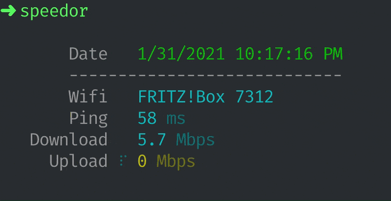

<div align="center">
    
</div>

<div align="center">
  <p> Test the internet connection speed and ping <strong>speedtest.net</strong> from the CLI</p>

  <p>
    <a href="#">
      
    </a>
    <a href="#">
      
    </a>
  </p>
</div>

<div align="center">
  
</div>

---

## Starting started
```bash
$ npm install --global speedor
$ speedor
```


## Usage

```
$ speedor --help

  Usage
    $ speedor

  Options
    --json -j     Output the result as JSON
    --bytes -b    Output the result in megabytes per second (MBps)
    --verbose -v  Output more detailed information
```


## License

MIT © [vikbert](https://vikbert.github.io)
